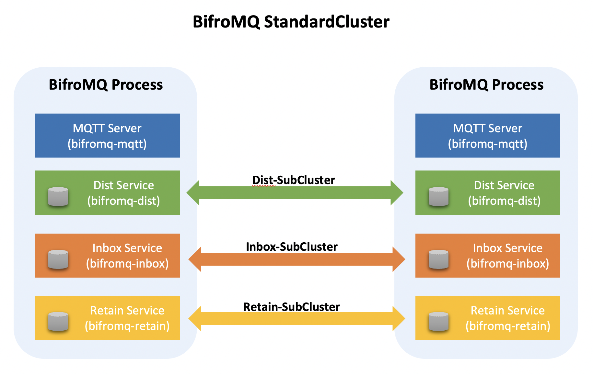
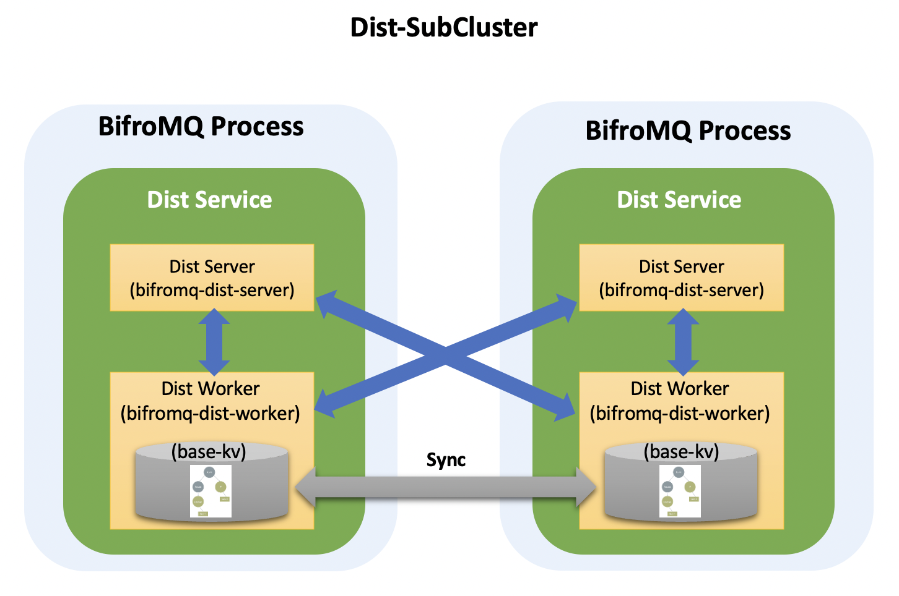

# Introduction
Since the initial release of BifroMQ, it has garnered significant attention within the community. Cluster capabilities have consistently been a focal point of interest and a top priority for the BifroMQ team. After relentless efforts over the past three months, we are pleased to announce the official launch of BifroMQ's cluster capabilities, which we refer to as the **Standard Cluster**.

The Standard Cluster is the primary supported cluster mode in the open-source version of BifroMQ, with each node in this mode possessing full MQTT protocol capabilities. This release also includes a highly anticipated feature – the HTTP API, designed to support the development and integration of management consoles, command-line interfaces, and more.

<!--truncate-->

## TLDR:
* Installation package [link](https://github.com/baidu/bifromq/releases/tag/v2.0.0) and installation [instructions](/docs/next/deploy/cluster/)
* Test [report](/docs/next/test_report/test_report/)
* API [documentation](/docs/next/user_guide/API/api/)

## Overall Structure of the Standard Cluster
In a previous architecture overview [article](2023-09-06-bifromq-architecture-overview.md), we mentioned that BifroMQ logically divides MQTT functionalities into several sub-services, each corresponding to a critical workload:
* bifromq-mqtt: Responsible for MQTT protocol connection workloads.
* bifromq-dist: Manages subscription and message routing distribution workloads.
* bifromq-inbox: Handles offline message queues within persistent sessions.
* bifromq-retain: Manages the storage and retrieval of Retain messages.

From a deployment perspective, BifroMQ StandardCluster encapsulates these independent workload service modules into a cluster mode within a single node service process, and logically, this can be seen as an abstraction of the Standalone operating mode (BifroMQ Standalone can be considered as a single-node version of BifroMQ StandardCluster). Unlike other MQTT Brokers that support clustering, BifroMQ incorporates built-in distributed persistence functionality, making each individual BifroMQ node "stateful."

*Note: In all illustrations in this article, the text within brackets, "bifromq-xxx," corresponds to the module names in the code.*

## Horizontal Scaling of Message Distribution Capability
In the Standard Cluster mode, the Dist Service module within each node process forms a logically partitioned subset cluster of workloads (Dist-SubCluster). Dist Service stores subscription information in a built-in persistence engine and synchronizes routing information between nodes using the persistence engine's distributed capabilities. In Standard Cluster mode, horizontal scaling of message distribution capability can be achieved by adding nodes, especially when CleanSession is set to True (see [test report](/zh-Hans/docs/next/test_report/test_report/)).

## Persistence, Scalability, and High Reliability of Offline Message Queues
Similar to the Dist Service module, the Inbox Service module within node processes, responsible for offline message queues within MQTT persistent sessions, forms another logically partitioned subset cluster of workloads (Inbox-SubCluster). Inbox Service persists offline queue messages in the built-in storage engine, significantly reducing data loss due to node failures. In terms of storage, Inbox Service leverages the sharding capability of the built-in storage engine, allowing horizontal scaling of storage capacity and processing power. Additionally, by dynamically increasing the number of shard replicas through static configuration or runtime policies, the reliability of offline message data can be further enhanced, which is especially important for applications with higher data reliability requirements.

*Note 1: Due to the significant impact of increasing shard replica count on message workloads when MQTT CleanSession is set to False, resource allocation must be determined based on actual needs, with the default replica count set to 1, which can be adjusted through the JVM startup parameter `inbox_store_range_voter_count`.*

*Note 2: The Inbox Service provides global access to offline message queues, allowing MQTT clients to access offline messages in their respective queues when reconnecting to any cluster node, eliminating the need for the common "sticky session" or "session migration" solutions often found in other MQTT Broker cluster implementations.*

## Load-Based Splitting Strategy for Inbox Service
As previously mentioned, in a Standard Cluster deployment, the Inbox Service within a single node process utilizes the sharding capability of the built-in storage engine to achieve horizontal scaling of storage capacity and processing power. However, the sharding strategy has a decisive impact on actual performance. In BifroMQ Standard Cluster, we have incorporated an out-of-the-box load-based splitting strategy. This strategy determines the partitioning of KV Ranges based on load conditions over a recent period, serving as a "posterior" splitting strategy. When the usage scenario has already been planned and understood for the distribution of offline message workloads, pre-partitioning typically results in more stable performance when the workload arrives. For advanced BifroMQ users, prior splitting strategies can be implemented through the SPI mechanism.

## HTTP API Module
BifroMQ StandardCluster introduces the HTTP API feature. Each cluster node can open an API access port through configuration. BifroMQ HTTP API is a stateless global interface designed to support the integration of management control logic at the business level. Accessing the API of any node allows operations on the entire cluster. For more details, please refer to [this link](/zh-Hans/docs/next/user_guide/API/api/).

## Impact of Mixed Workloads on Performance
In a Standard Cluster deployment, a single node possesses complete MQTT protocol functionality, handling various types of workloads. Therefore, this mode is particularly suitable for two types of enterprise-level application scenarios:
1. Workloads generated by the business are relatively uniform.
2. The business generates a diverse range of workloads, but they are relatively evenly distributed in time.
   For cases where workloads are complex and generated centrally in terms of time, we recommend that users perform load testing to determine the optimal resource configuration and parameter settings for a single BifroMQ Standard Cluster cluster or consider using multiple BifroMQ Standard Clusters to handle different types of business workloads. Additionally, you can reach out to us for support with BifroMQ Independent-Workload Cluster in the BifroMQ commercial version.

## Deployment and Operations
In a previous BifroMQ technical architecture article, we mentioned that BifroMQ clusters are built on a decentralized technology (base-cluster), eliminating the need for external node registration and discovery services. As a result, the deployment process for building a BifroMQ Standard Cluster is straightforward (for detailed instructions, please refer to [this link](/zh-Hans/docs/next/deploy/cluster/)). It only requires designating any node in a cluster as a seed node to enable the addition of new nodes. Furthermore, BifroMQ includes self-healing capabilities in the event of cluster partitioning, greatly simplifying operational tasks during network partition and other failures.

## Future Outlook
The BifroMQ team adheres to a neutral technology philosophy, dedicated to the large-scale implementation of the MQTT protocol, as well as improving reliability and maintainability. We look forward to more community participation and in-depth user feedback to collectively advance this technology. Additionally, you can join the developer community by scanning the QR code below

or by joining our Discord group via this [link](https://discord.gg/Pfs3QRadRB).