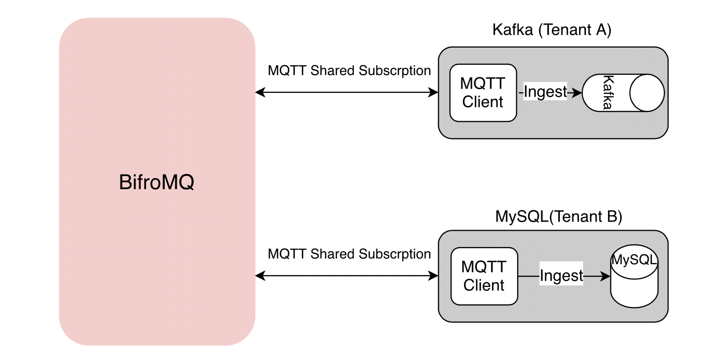

# Data Integration

## Basic Concepts

In addition to utilizing traditional devices to receive messages and events from BifroMQ, users can also employ SDKs for data integration and connection between BifroMQ and customized services. The integration method is illustrated below:



Integrators receive data from BifroMQ through shared subscriptions (`$share/{groupName}/topicFilter`) and pass the data to downstream services such as Kafka or MySQL. Due to the large volume of data in inter-service integration, a single MQTT connection may experience high load and bandwidth constraints. By using shared subscriptions, the load-balancing feature is utilized, and the number of MQTT Clients can be flexibly increased or decreased as the business evolves.

Therefore, integrators need to estimate the size of the data and the corresponding bandwidth resources based on their business requirements, in order to calculate the number of MQTT Clients needed. For example, if the message rate from BifroMQ is 10MB/s and the bandwidth per Client is 512KB/s, at least 20 Clients are needed.

The SDK encapsulates the MQTT Client. Users need to specify the number of Clients, shared group, topic, and whether it is a `cleanSession`, and implement the business logic for data received by the MQTT Client. [Demo SDK](https://github.com/Gujiawei-Edinburgh/Data-Integration) provides an implementation as shown in the above diagram, along with examples.
```java
IIntegrator integrator = Integrator.builder()
                .clientNum(5)
                .groupName("g1")
                .topicFilter("test/data/integration")
                .cleanSession(true)
                .userName("dev")
                .password("dev")
                .port(1883)
                .host("BifroMQ host")
                .build();
integrator.onMessageArrive()
        .doOnComplete(IProducer.DUMMY::close)
        .subscribe(IProducer.DUMMY::produce);
```
As `IIntegrator` encapsulates the MQTT Client, it needs the connection information to be specified. To ensure message transmission quality, `IIntegrator` uses `QoS = 1` by default, meaning that messages will be delivered at least once. This may result in duplicated messages for downstream services. For MQTT related parameters, refer to the [MQTT Protocol](..%2F..%2F21_mqtt%2F1_mqtt.md). Information regarding shared subscriptions can be found in [Shared Subscription](..%2F1_connect%2F1_connect.md).

Integrators can implement the `IProducer` interface to execute specific business logic. An example is provided with `IProducer.DUMMY`, which prints the received messages.

## Points to Note
* Limitations of shared groups. Currently, the default maximum capacity of shared groups supported by BifroMQ is `200`. However, One can change the limit through `settingProvider`. If the integrator expects the number of clients to exceed the limit, subscriptions will fail for these clients exceeding this limit.
* Choice of topicFilter for integrators. According to the MQTT protocol, subscriptions can be non-wildcard or wildcard. Below, based on BifroMQ’s implementation, scenarios for both non-wildcard and wildcard subscriptions are discussed:
  * Non-wildcard subscription: The topicFilter of the integrator exactly matches the topic from the upstream sender. In BifroMQ, the corresponding routing information is cached as a single entry, resulting in a high cache hit rate for this scenario.
  * Wildcard subscription: If all upstream senders use the same topic, this scenario is similar to non-wildcard subscription, having a high cache hit rate. If the upstream senders use different topics, such as `test/data/{clientId}`, it will cause (1) BifroMQ to cache a large number of entries, possibly exceeding the cache size limit; (2) if the shared group is also large, it will result in increased latency in routing queries for a single topic, and for a large number of different topics, it will lead to many topics not hitting the routing cache, resulting in a decline in overall performance and Out Of Memory (OOM) issues. To address issue (1), adjusting the cache size (`SysProp: DIST_MAX_CACHED_SUBS_PER_TRAFFIC`) can improve cache hit rates; for issue (2), increasing cache expiration time (`expireAfterAccess`) can improve hit rates.