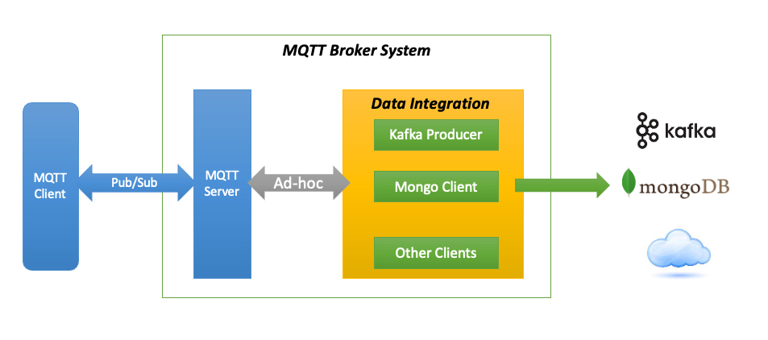
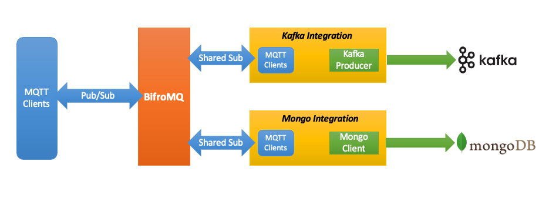

This document aims to provide a recommended approach for integrating BifroMQ with various systems, facilitating seamless message communication across different platforms. BifroMQ's unique architecture and capabilities make it a versatile
tool for creating sophisticated IoT messaging ecosystems.

## Understanding Data Integration with BifroMQ

Data Integration with BifroMQ involves a bidirectional flow of messages between BifroMQ and external systems, including databases, rule-based message forwarding systems, other messaging middleware or another MQTT
Broker deployment. This integration encompasses several key aspects:

- **Protocol Conversion**
- **Service Quality Matching**
- **Message Routing**
- **Flow Control**
- **Monitoring**
- **Scalability Considerations**

### Commonly Used Approach

Traditionally, integration approaches embed downstream system clients directly within the MQTT Broker. This method utilizes ad-hoc communication mechanisms and mapping logic to achieve protocol conversion, treating the MQTT protocol
implementation and integration with heterogeneous systems as a unified whole.

### Non-Coupled Approach for Heterogeneous System Integration

Contrary to the traditional method, BifroMQ takes a non-coupled integration approach, leveraging MQTT standard capabilities to ensure the reusability of connection logic across different MQTT brokers. This strategy allows BifroMQ to
concentrate on enhancing its core broker functionalities, promoting a more modular and flexible integration ecosystem.

## Directions of Message Flow Integration

BifroMQ supports message integration in two primary directions:

### 1. From BifroMQ to External Systems

BifroMQ recommends for the use of the [shared subscription](../1_basic/3_shared_sub.md) feature to balance the load of messages sent to downstream systems, taking advantage of MQTT's QoS capabilities for semantic message forwarding. This approach requires maintaining a
set of MQTT client connections that subscribe to BifroMQ. Notably, BifroMQ supports shared subscriptions across MQTT versions 3.1, 3.1.1, and 5.0.

### 2. From External Systems to BifroMQ

External systems can publish messages to BifroMQ using direct MQTT client connections or the HTTP Restful API, providing a straightforward method for message injection into the BifroMQ deployment.

## Notes on Implementing Data Integration

When integrating data with BifroMQ, consider the following:

1. **Bandwidth Limitations**: BifroMQ defaults to a bandwidth limit of 512kb/s per MQTT connection, adjustable via Tenant Settings. It's crucial to calculate the number of connections needed based on actual business demands when receiving
   forwarded messages through shared subscriptions.

2. **Flow Control**: Utilizing MQTT as the forwarding protocol inherently provides flow control. Downstream systems must have sufficient resources to receive forwarded messages to avoid backpressure-induced message loss.

3. **Monitoring**: Thanks to the use of MQTT protocol, the monitoring metrics provided by BifroMQ can be directly reused during the message forwarding phase, simplifying the integration monitoring process.

## Reference for Starter

To aid in your integration efforts, we recommend exploring the community [project](https://github.com/bifromqio/bifromq-data-integration) which demonstrates the concepts discussed in this guide. This project showcases practical examples of configuring shared subscriptions,
managing bandwidth limitations, and setting up monitoring for BifroMQ integrations.
