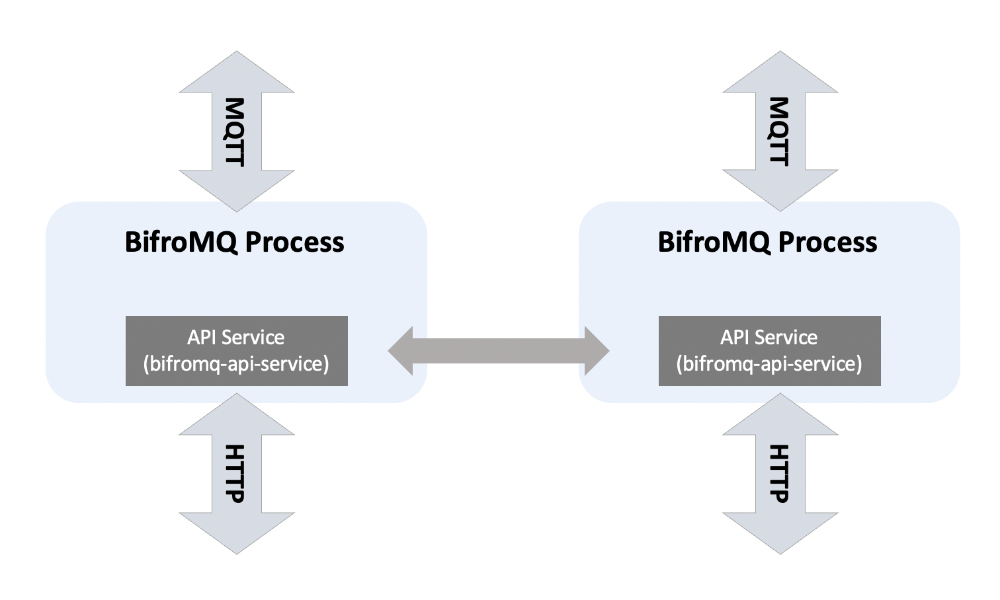

## 引言
自 BifroMQ 首个版本发布以来，它已经获得了广泛的社区关注。其中，集群能力一直是备受关注的焦点，也一直是 BifroMQ 团队优先考虑的工作项之一。近三个月的不懈努力后，我们正式推出了 BifroMQ 的集群能力，我们将其称为**标准集群**。
标准集群（StandardCluster）是 BifroMQ 开源版本的主要支持集群模式，每个节点在此模式下具备完整的 MQTT 协议能力。此版本还包括备受关注的功能之一——HTTP API，以便支持控制台、命令行等管理控制端的开发和集成。

<!--truncate-->

## TLDR：
* 安装包[地址](https://github.com/baidu/bifromq/releases/tag/v2.0.0)及安装[说明](/zh-Hans/docs/next/deploy/cluster/)
* 测试[报告](/zh-Hans/docs/next/test_report/test_report/)
* API[文档](/zh-Hans/docs/next/user_guide/API/api/)

## StandardCluster 的整体结构
在先前的整体架构[文章](2023-09-06-bifromq-architecture-overview.md)中，我们提到 BifroMQ 将逻辑上的 MQTT 功能从负载的角度分解为若干子服务，每个子服务对应一类关键负载：
* bifromq-mqtt：负责 MQTT 协议连接负载
* bifromq-dist：负责订阅和消息路由分发负载
* bifromq-inbox：负责持久会话中的离线消息队列负载
* bifromq-retain：负责 Retain 消息存取负载
从部署的角度看，BifroMQ StandardCluster是将这些独立负载的服务模块"封装"到一个节点服务进程的集群模式，从逻辑上来说，这是对 Standalone 运行模式的抽象（BifroMQ Standalone 可以看作是单个节点的 BifroMQ StandardCluster）。与其他支持集群的 MQTT Broker 不同，BifroMQ 内置了分布式持久化功能，因此单个 BifroMQ 节点是"有状态的"（Stateful）。

*注：本文所有插图中括号内的`bifromq-xxx`，即为代码中对应的模块名称*

## 消息分发能力的水平扩展
在 StandardCluster 集群模式下，每个节点进程内的 Dist Service 模块构成了逻辑上的负载子集群（Dist-SubCluster）。Dist Service 将订阅信息存储在内置的持久化引擎中，并通过持久化引擎的分布式功能在节点之间同步路由信息。在 StandardCluster 模式下，通过增加节点的方式，可以实现消息分发能力的水平扩展，特别是在 CleanSession 为 True 的情况下，这一点非常明显（详见：[测试报告](/zh-Hans/docs/next/test_report/test_report/)）。

## 离线消息队列的持久化、扩展性及高可靠性
与 Dist Service 模块类似，节点进程内负责 MQTT 持久会话中离线消息队列的 Inbox Service 模块构成了另一个逻辑上的负载子集群（Inbox-SubCluster）。Inbox Service 将离线队列消息持久化到内置的存储引擎中，可以极大程度地减少因节点故障导致的数据丢失。在存储方面，Inbox Service 利用了内置存储引擎的分片功能，存储规模和处理能力可以水平扩展。此外，通过静态配置或运行时策略动态增加分片的副本数，可以进一步提高离线消息数据的可靠性。这对某些对数据可靠性要求更高的应用场景尤为重要。

*注1：由于增加分片副本数对 MQTT CleanSession 为 False 的消息负载有不可忽视的影响，需要根据实际需求确定资源投入以达到预期效果。因此，默认副本数为1，该设置可以通过 JVM 启动参数 `inbox_store_range_voter_count` 进行调整*

*注2：Inbox Service 提供了离线消息队列的全局访问能力，因此 MQTT 客户端重新连接到任何集群节点时都可以访问所属队列中的离线消息，无需引入在其他MQTT Broker集群实现中常见的sticky session或session migration方案*

## Inbox服务的基于负载的拆分策略
如前文所述，StandardCluster 部署下，单个节点进程内的 Inbox Service 利用了内置存储引擎的分片功能来实现存储规模和处理能力的水平扩展。然而，分片策略对实际运行效果有着决定性的影响。在 BifroMQ StandardCluster 版本中，我们内置了开箱即用的基于负载的拆分策略（Load-based Splitting）。该策略通过统计最近一段时间内的负载情况来决定对KV Range的划分。可以视为一种"后验"拆分策略。当使用场景已经对离线消息负载的分布有提前规划和了解时，提前划分 Range 通常能在负载到来时带来更稳定的性能表现。对于深度使用 BifroMQ 的用户，可以通过 SPI 机制实现此类"先验"拆分策略。

## HTTP API模块
BifroMQ StandardCluster 版本同时引入了 HTTP API 功能。每个集群节点都可以通过配置开放 API 访问端口。BifroMQ HTTP API 是无状态的全局接口，旨在支持业务层面的管理控制逻辑的集成。访问任何一个节点的 API 都可以实现对整个集群的操作。详细信息可以参见[此链接](/zh-Hans/docs/next/user_guide/API/api/)。

## 混合负载对性能的影响
在 StandardCluster 部署下，单个节点具备完整的 MQTT 协议功能，承担各种类型的负载。因此，这种模式特别适用于以下两类企业级应用场景：
1. 业务产生的负载类型相对单一
2. 业务产生的负载类型多元化，但产生时间相对分散
对于负载形式复杂且在时间维度上有集中产生的情况，我们建议用户通过模拟负载测试来获得单个 BifroMQ StandardCluster 集群下的最佳资源配置和参数设置，或者考虑使用多个 BifroMQ StandardCluster 来承载不同类型的业务负载。另外，您还可以与我们联系，获取 BifroMQ 商业版本的独立负载集群（Independent Workload Cluster）支持。

## 部署过程和运维
在之前的 BifroMQ 技术架构文章中，我们提到 BifroMQ 集群建立在一套内置的去中心化技术之上（base-cluster），无需依赖外部节点注册和发现服务。因此，构建 BifroMQ StandardCluster 的部署过程非常简单（详细过程请参考[此链接](/zh-Hans/docs/next/deploy/cluster/)），只需指定任何一个集群中的节点作为种子节点，即可完成新节点的加入。此外，BifroMQ 还内置了集群分裂后的自愈能力，可以极大地简化出现网络分区（Network Partition）等故障时的运维操作。

## 未来展望
BifroMQ 团队一直秉持技术中立理念，致力于大规模实现 MQTT 协议、提高可靠性和可维护性等方面。我们期待更多社区参与和深入使用反馈，共同推动这一技术的成熟。此外，您还可以通过扫描下方二维码加入开发者交流社区，与广大同行进行交流学习。

或加入我们的 Discord 群组：